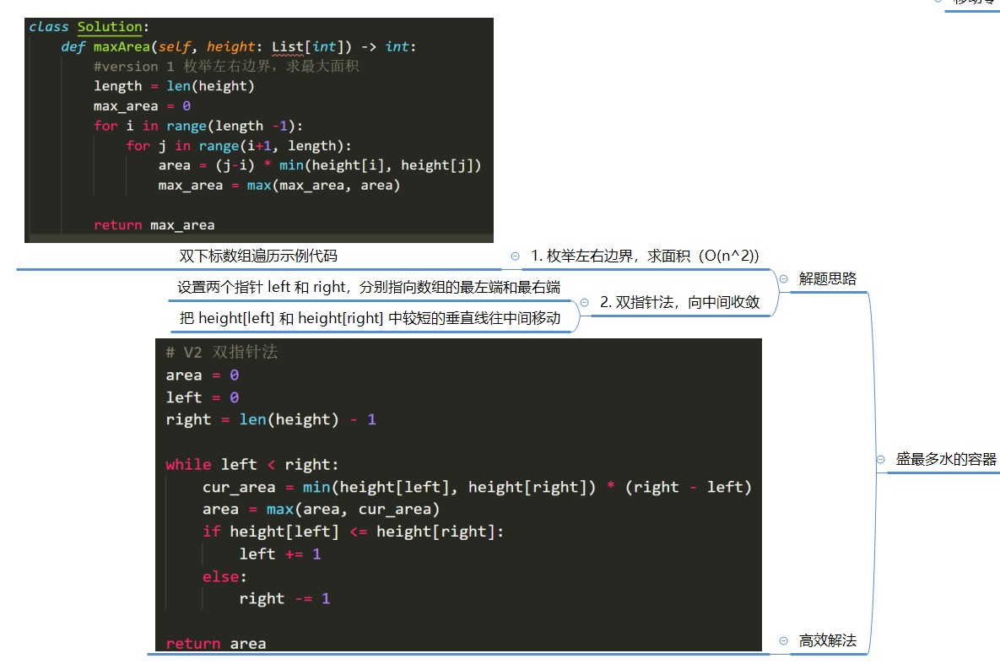
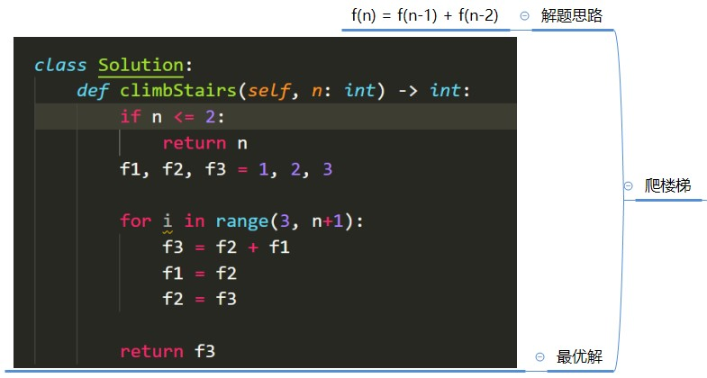
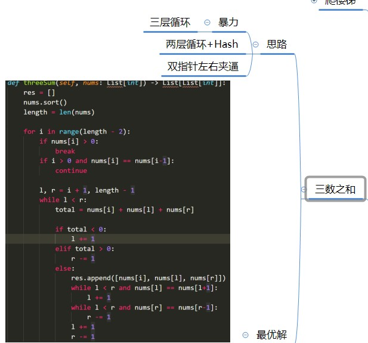
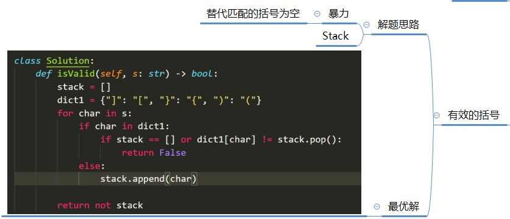
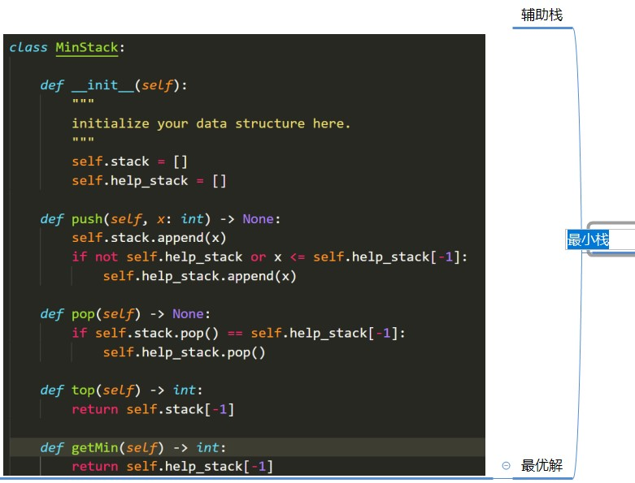
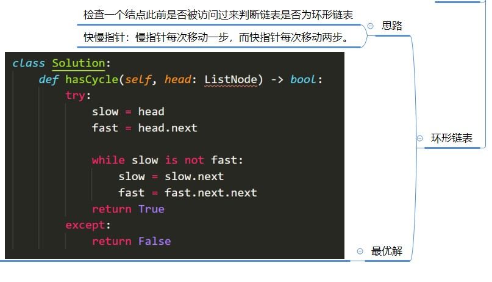

## 五毒刷题法
1. 5-10分钟，自己读题并思考解题思路。
2. 如有思路自己开始写代码，不然马上看题解
3. 默写背诵且熟练高效的写法
4. 以闭卷形式，开始自己写
5. 学习官方和其他大牛的题解
6. 学习国际站大牛的写法

### 基础知识：数组，链表，堆栈，队列

### Leetcode:283 移动零

### Leetcode:11 盛最多水的容器

### Leetcode:70 爬楼梯

### Leetcode:15 三数之和

### Leetcode:20 有效的括号

### Leetcode:155 最小栈

### Leetcode:141 环形链表

### Python 队列与优先队列

  Python的Queue模块提供一种适用于多线程编程的FIFO实现。Queue类实现了一个基本的先进先出(FIFO)容器，使用put()将元素添加到序列尾端，get()从队列尾部移除元素

  LifoQueue使用后进先出，最后put()到队列的元素最先被get()

  Priority Queue（优先队列）
  依据队列中内容的排序顺序(sort order)来决定那个元素将被检索，get()被调用时，会依据其优先级被处理。
  