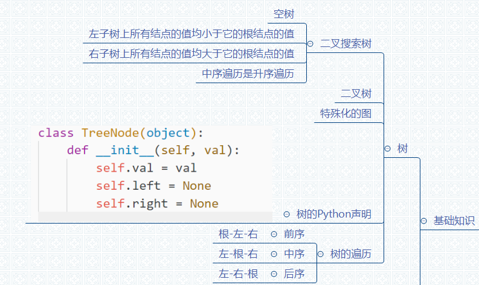
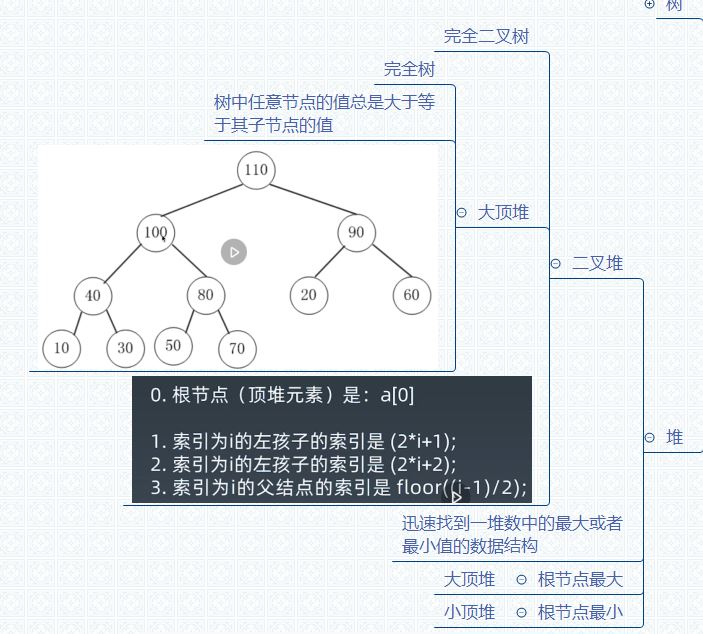
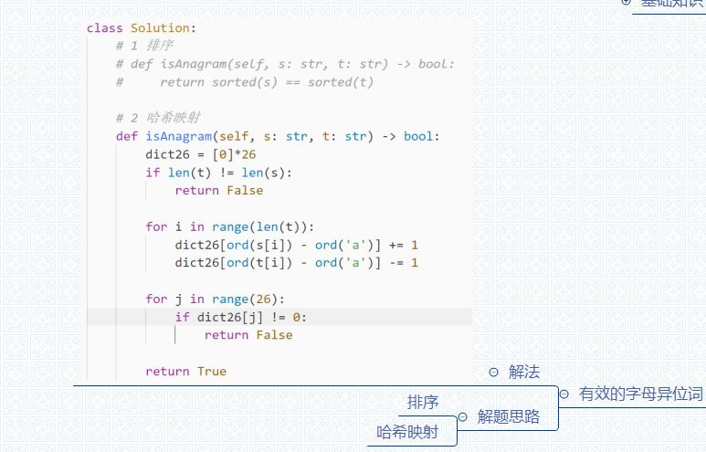
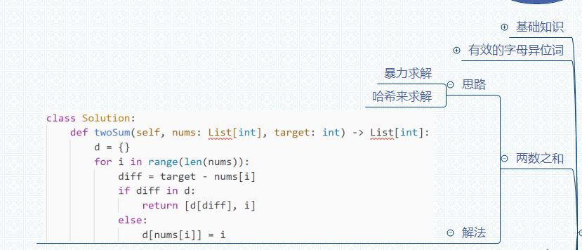
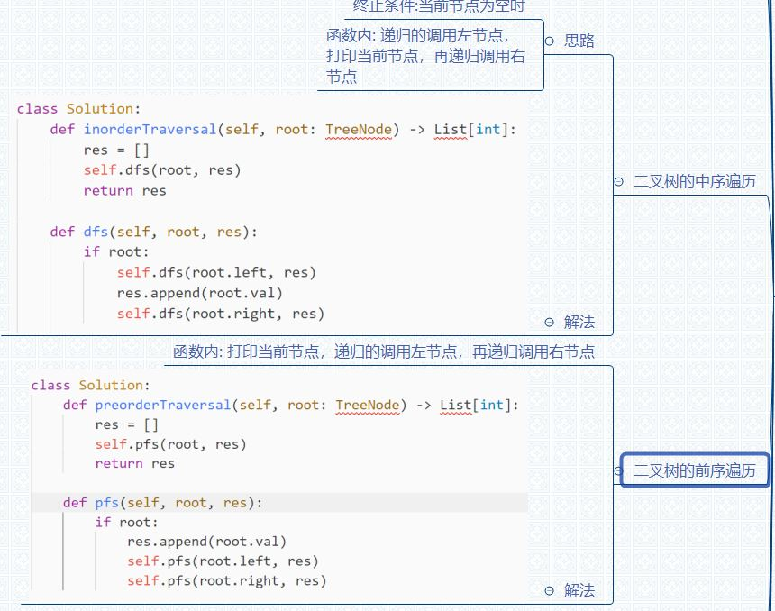
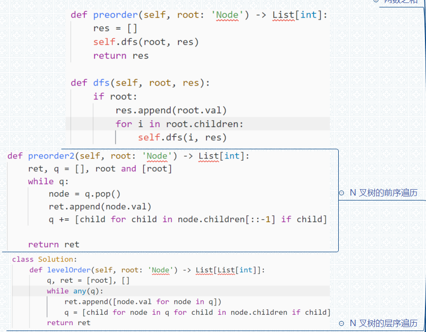

# 2nd Week 学习笔记
## 基础知识
* 树 二叉树 二叉搜索树
  
* 堆 二叉堆
  

## 经典算法
* Python中的HashMap总结
  
  Python3中dict采用了哈希表，查询时间复杂度 O(1)，在发生哈希冲突的时候采用了开放寻址法

* Leetcode #242 有效的字母异位词
  

* Leetcode #1 两数之和
  

* Leetcode #94 & #144 二叉树的中序及前序遍历
  

* Leetcode #[429](https://leetcode-cn.com/problems/n-ary-tree-level-order-traversal/) & 589 N 叉树的前序与层序遍历
  